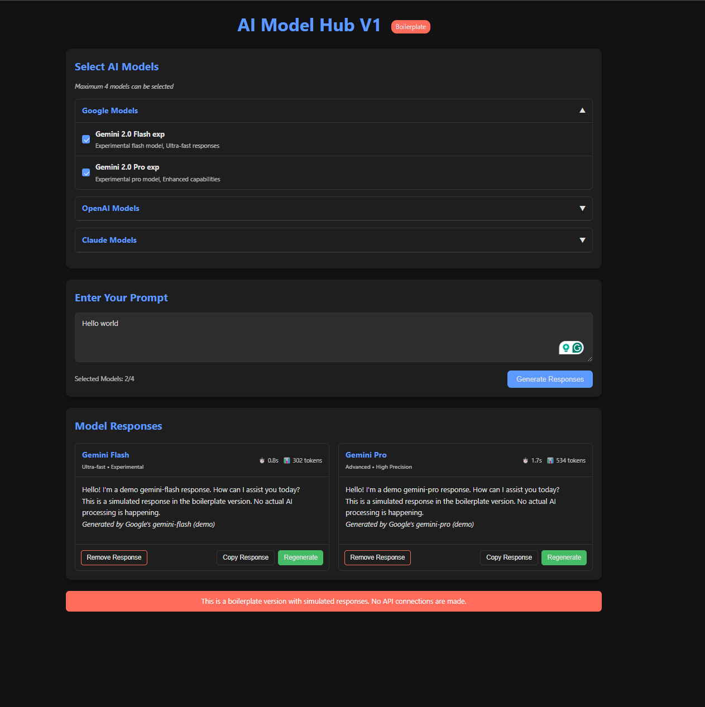

# AI Model Hub Boilerplate

A modern, interactive interface for comparing responses from multiple AI language models in a single view.



## Overview

The AI Model Hub is a boilerplate web application designed to help users compare responses from different AI language models side-by-side. This version simulates responses from various models to demonstrate the UI/UX without requiring API keys or making actual API calls.

### Features

- **Multi-model selection**: Choose from popular AI models including GPT (OpenAI), Claude (Anthropic), and Gemini (Google)
- **Modern UI**: Clean, responsive design with light and dark theme support
- **Interactive interface**: Collapsible sections, visual feedback, and animated loading states
- **Response management**: Copy, remove, or regenerate simulated responses
- **Visual comparison**: Side-by-side comparison of multiple AI model outputs
- **Adaptive layout**: Responsive grid adjusts based on the number of selected models

## Getting Started

### Prerequisites

No special prerequisites are required. This is a static HTML/CSS/JavaScript application that runs in any modern web browser.

### Installation

1. Clone this repository:
   ```
   git clone [repository-url]
   ```

2. Open the `index.html` file in your web browser.

That's it! No build process, packages, or server setup is required.

## Usage

1. **Select AI models**: Choose up to 4 AI models by checking the boxes under each provider section.
2. **Enter your prompt**: Type your query or instruction in the text area.
3. **Generate responses**: Click the "Generate Responses" button to see simulated outputs.
4. **Compare responses**: View the different responses side-by-side.
5. **Manage responses**: Use the buttons at the bottom of each response to copy, remove, or regenerate.
6. **Toggle theme**: Click the theme toggle button in the top right corner to switch between light and dark modes.

## Structure

The project follows a standard web development structure:

